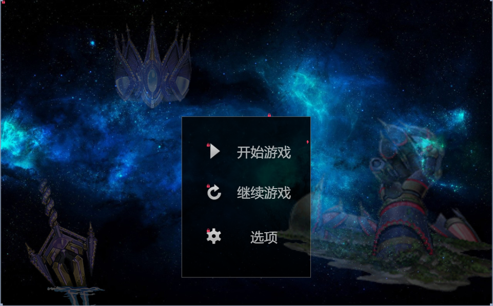
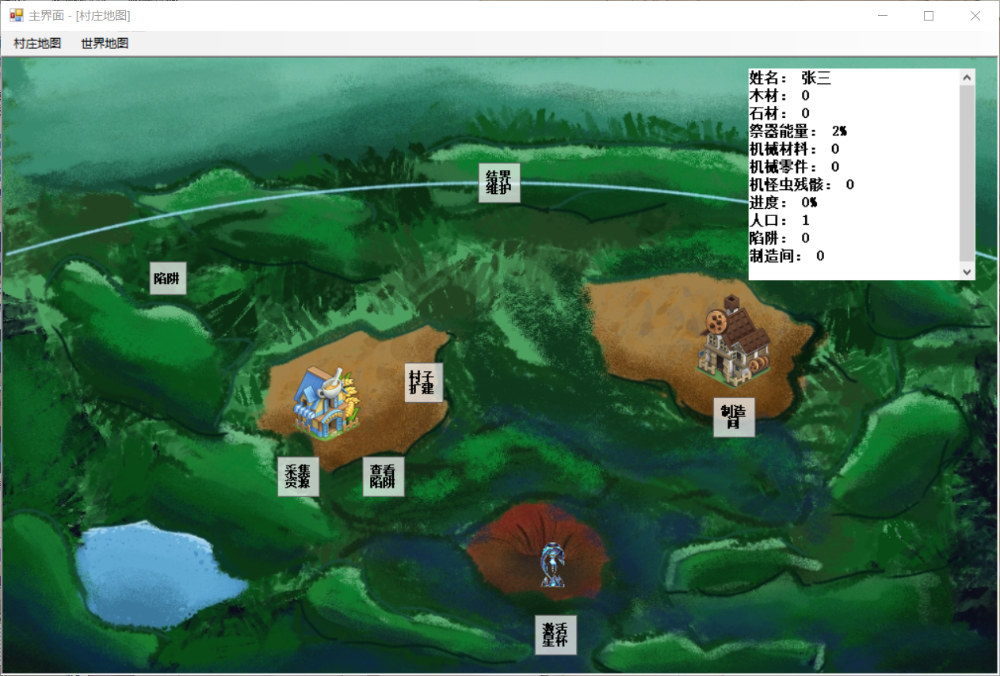

# 星遗物 WORLD-LEGACY
---
本游戏是基于游戏王卡图故事星遗物系列所进行的二次创作，是一款文字模拟经营游戏。玩家扮演的主角在星遗物后废土时代收集资源，壮大自己的力量的同时，将在世界中展开探索，推进故事的发展，并最终探寻古文明衰落与星球力量的真相。

本游戏所指的文字模拟经营的概念，是指完全通过以文字的方式，让玩家体验到扮演管理者角色，对游戏中的虚拟资源进行经营管理、统筹规划的快乐。

本游戏是基于C#开发的windows应用程序，仅可在Windows系统上运行。

# 开始
## 依赖项
前置软件为access database engine 2016

## 安装流程
下载安装软件按照安装流程正常安装即可。

# 开始游玩
开启应用程序之后将会显示游戏的标题页面

在点击开始游戏之后将会自动新建存档并唤出游戏主页面，玩家可以通过点击上方的村庄地图与世界地图来进入游戏的经营模式与故事模式，后续故事将依据经营资源的规模陆续解放。

# 项目调试
github地址 https://github.com/freeforeverdom/World-Legacy
本程序基于VScode studio 2022开发，请基于该软件对项目进行调试与修改

# 作者与贡献者
作者团队：执著队
团队成员及分工
熊锋:总设计与各阶段测试
张子轩:游戏代码编写
姚雨航:游戏代码编写
李晟晗:游戏文本编写
鄢子杰:游戏UI优化

# 项目协议
.NET Framework 4.7.2

# 致谢
感谢游玩本游戏，祝您游戏愉快。