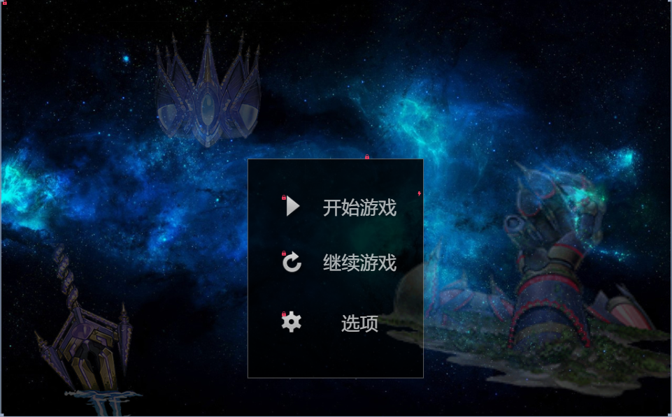
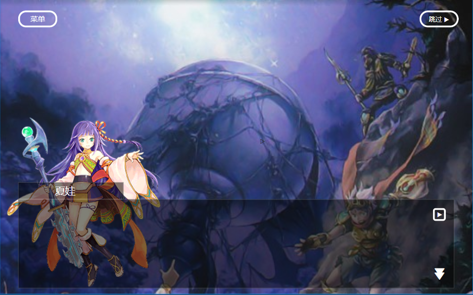

# 标题切入
在开始游戏前可插入一段动画，鉴于游戏为完全单机且不作发布打算，具体文件可直接使用：   
[星遗物传说](https://www.bilibili.com/video/BV1FV411Z71f?spm_id_from=333.999.0.0&vd_source=9e7fbe4704fe37a0d06d81745b212f48)，并支持单击左键跳过
也可作一定剪辑，在符合条件的情况下作改变。  

## 初始页面设计
须支持开始游戏，继续游戏，选项，退出  
附加选项也可有帮助或相关等  
UI大致如下  

## 叙事框图设计
即游戏的对话框设计，分为剧情时的对话框以及自由游玩时的对话框。
与大部分手游相同，设计大致如下：

## 主页面设计
与小黑屋大致相同，但是需要相应的地图绘制与资源显示器，在此使用fgo的地图作一定的解释，具体的地图绘制。

总体的星球地图可参照崩界的守护龙与星遗物的相对位置关系来绘制世界地图  
将星辰之森的位置放在地图中央，并标定各地标建筑物的位置。

然后则是大本营：星辰之森的地图绘制，大致的运营思路与小黑屋完全相同，仅需更改物件名称即可。第二部之后位置即可更换至星冠。

